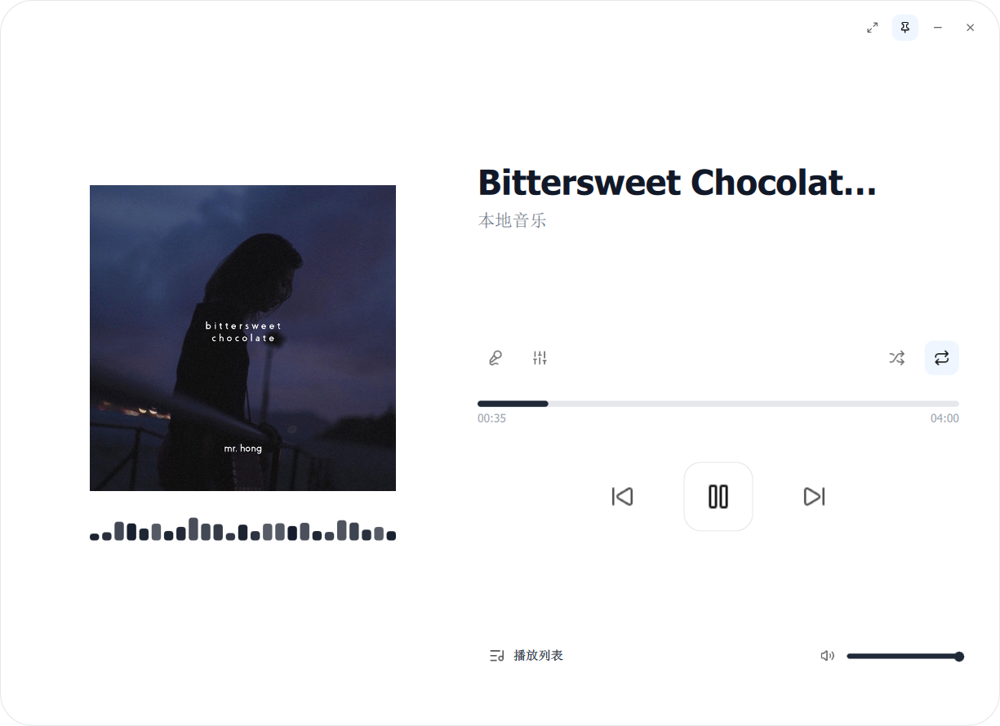
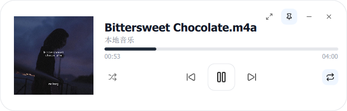

<p align="center">
  
</p>

<h1 align="center">MusicPlayer</h1>

<p align="center">
  A modern, minimalist music player built with Qt 6 QML.
</p>

---

## Screenshots

<p align="center">
  
  
</p>

## Features

- **Dual Mode**: Full player with lyrics display / Compact mini player
- **Edge Snapping**: Mini mode snaps to screen edges
- **System Tray**: Full control from tray menu with icons
- **LRC Lyrics**: Synchronized lyrics display
- **Album Art**: Automatic extraction from audio files
- **Frameless Window**: Custom window controls with pin support

## Recent Changes

### UI Polish
- **IconButton**: Removed flashing hover background
- **AlbumArt**: Fixed image rendering issues
- **MiniPlayer**: Adjusted padding for visual balance
- **PlaylistOverlay**: Fixed close button cursor interaction
- **WindowControls**: Optimised layout and pin button position

### New Features
- **Edge Snapping**: Mini player automatically snaps to screen edges (20px threshold)
- **System Tray**: Enhanced menu with icons for all actions

### Bug Fixes
- Fixed song info not updating on auto-play
- Fixed cursor conflicts in playlist overlay

## Build

```bash
cmake -B build -DCMAKE_PREFIX_PATH=D:/Qt/6.x.x/msvc2022_64
cmake --build build --config Release
```

## Tech Stack

- **Framework**: Qt 6.10+ (QtQuick, QtMultimedia)
- **Language**: C++17, QML
- **Media Engine**: FFmpeg
