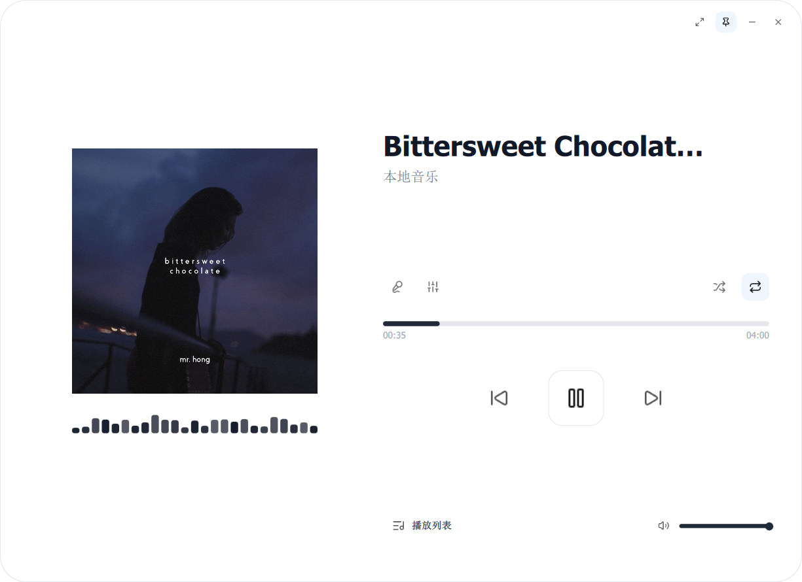
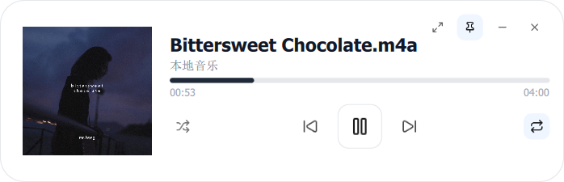

<p align="center">
  
</p>

<h1 align="center">Mi</h1>

<p align="center">
  A lightweight local music player built with Rust and <a href="https://www.gpui.rs">GPUI</a>,
  with synchronized lyrics, three window modes, and a live equalizer.
</p>

---

## Screenshots

<p align="center">
  
  
</p>

## Features

- **Three window modes**: the full player, a compact mini player, and a "dynamic island" pill
  pinned to the top of the screen, with animated transitions between them
- **Synchronized lyrics** from `.lrc` files next to the track, with automatic encoding detection
  (UTF-8, UTF-16, GB18030, Shift-JIS)
- **Album art and tags**: embedded cover, title and artist, or a `song.jpg` / `song.png` next to the track
- **3-band equalizer** (bass / mid / treble) that is applied live to the audio
- **Shuffle with history** (previous/next walk back and forth through what was played) and repeat-one
- **System tray** with playback controls; closing the window keeps the music playing
- **Frameless translucent window** with day/night themes, adjustable material strength, pin-on-top
  and edge snapping in mini mode
- **Chinese and English** interface
- Single instance: launching again brings the running player to the front

Supported formats: MP3, FLAC, WAV, AAC/M4A (AAC and ALAC), Ogg Vorbis.

### Keyboard shortcuts

| Key | Action |
| --- | --- |
| `Space` | Play / pause |
| `←` / `→` | Previous / next track |
| `↑` / `↓` | Volume ±5 |
| `M` | Mute |
| `L` | Playlist |
| `E` | Equalizer |

## Build

Requires a recent stable Rust toolchain (edition 2024).

```bash
cargo run --release
```

Platform prerequisites:

- **Windows**: Visual Studio Build Tools (MSVC) and the Windows SDK. Release builds compile
  shaders with the SDK's `fxc.exe`; if it is not found automatically, set `GPUI_FXC_PATH`
  to its full path.
- **Linux**: `clang pkg-config libssl-dev libasound2-dev libxkbcommon-dev libxkbcommon-x11-dev
  libwayland-dev libx11-xcb-dev libxcb1-dev libfontconfig-dev libfreetype6-dev libvulkan-dev libdbus-1-dev`
- **macOS**: full Xcode with the Metal compiler (`xcrun --find metal` and `xcrun --find metallib`).
  The release workflow uses Xcode 16.4 and a macOS 11.0 deployment target.

Pinning, island positioning and edge snapping use Win32 APIs; on other platforms those
features are unavailable and closing the window minimizes it instead of hiding it to the tray.

The executable is `target/release/Mi.exe` on Windows and `target/release/Mi` on Linux/macOS.

To build the Windows installer locally, install [Inno Setup 6](https://jrsoftware.org/isinfo.php),
then run from the repository root:

```powershell
cargo build --release --locked
.github/scripts/build-installer.ps1 -Version 1.1.0
.github/scripts/package-windows.ps1 -Version 1.1.0
```

The installer script verifies the name and version embedded in `Mi.exe`. Pass `-BinaryPath`
when using a binary built with an explicit Rust target, or `-CompilerPath` for an Inno Setup
installation outside the default directory. Output packages go to `dist/`.

To package a Linux or macOS build locally, use the matching target:

```bash
# Linux x64; use x86_64-apple-darwin or aarch64-apple-darwin on the corresponding Mac.
cargo build --release --locked --target x86_64-unknown-linux-gnu
bash .github/scripts/package-unix.sh 1.1.0 x86_64-unknown-linux-gnu
```

On macOS, set `MACOSX_DEPLOYMENT_TARGET=11.0` before building and packaging.

## Install

Release packages are published at [Mi Releases](https://github.com/Sqhh99/Mi/releases).
Each package includes a matching `.sha256` checksum file.

| Platform | Package | Usage |
| --- | --- | --- |
| Windows x64 | `Mi-<version>-windows-x64-setup.exe` | Install for the current user, with no administrator rights; offers an optional desktop shortcut |
| Windows x64 | `Mi-<version>-windows-x64-portable.zip` | Extract and launch `Mi.exe` |
| Linux x64 | `Mi-<version>-linux-x64.tar.gz` | Extract and run `./Mi` inside the extracted folder |
| macOS Intel | `Mi-<version>-macos-x64.app.zip` | Extract and drag `Mi.app` into Applications |
| macOS Apple Silicon | `Mi-<version>-macos-arm64.app.zip` | Extract and drag `Mi.app` into Applications |

Linux releases are built on Ubuntu 22.04 and use system libraries rather than bundling them.
They require a graphical X11 or Wayland session, a working Vulkan driver, ALSA, Fontconfig,
FreeType, XCB, xkbcommon and D-Bus. A desktop portal is needed for the file picker, and a
StatusNotifier-compatible desktop or extension is needed for the tray icon. Install the
corresponding runtime packages for your distribution; `ldd ./Mi` identifies missing linked
libraries. The tarball is not an AppImage or a distribution-specific installer.

Windows releases are not code-signed. macOS bundles use ad-hoc signing without Apple
notarization; macOS may require allowing the app in System Settings > Privacy & Security
after the first launch attempt. The deployment target is not a guarantee that all older
macOS versions have been tested.

## Release

The workspace version in `Cargo.toml` is the single source of truth:

1. Update the numeric `x.y.z` version, refresh `Cargo.lock`, and commit the changes.
2. Push a matching tag, for example `v1.1.0`.

`.github/workflows/release.yml` checks the tag before building Windows/Linux x64 and
macOS Intel/Apple Silicon packages. All four builds and workspace tests must succeed
before a single GitHub Release is created or updated with all five packages and their
SHA-256 checksums. A missing package or invalid checksum prevents publication.

You can also run the workflow manually: select a branch to download build artifacts
without publishing, or select a matching version tag to publish its release.

## Project layout

```
crates/player-core/   Platform-independent logic and unit tests:
                      play queue (shuffle/repeat), LRC parsing, EQ filters,
                      settings, strings (zh/en), geometry and easing
src/
  audio/              Audio thread (rodio) and the equalizer source
  media/              Tag, cover art and duration reading (lofty)
  model/              PlayerModel and SettingsModel, shared by all views
  platform/           Win32 window helpers, system tray, single instance
  ui/                 Theme, widgets and views (full / mini / island, overlays)
  app.rs              Wiring: window, tray, persistence
resources/            App icon and Lucide SVG icons
installer/            Inno Setup script for the Windows installer
.github/scripts/      Local and CI packaging scripts
```

Settings are stored as JSON in the user config directory:

- **Windows**: `%APPDATA%\sqhh99\Mi\config\settings.json`
- **Linux**: `$XDG_CONFIG_HOME/mi/settings.json`, or `~/.config/mi/settings.json`
- **macOS**: `~/Library/Application Support/com.sqhh99.Mi/settings.json`

Mi starts with new settings and does not import the former MusicPlayer configuration.
Old configuration files are retained. The per-user installer does not migrate a former
all-users installation; manage that installation separately.

```bash
cargo test --workspace   # all tests
cargo test -p player-core   # core logic only, no GPUI build needed
```

## Tech stack

- **UI**: [GPUI](https://crates.io/crates/gpui)
- **Audio**: [rodio](https://crates.io/crates/rodio) + [symphonia](https://crates.io/crates/symphonia)
- **Metadata**: [lofty](https://crates.io/crates/lofty)
- **Icons**: [Lucide](https://lucide.dev)
